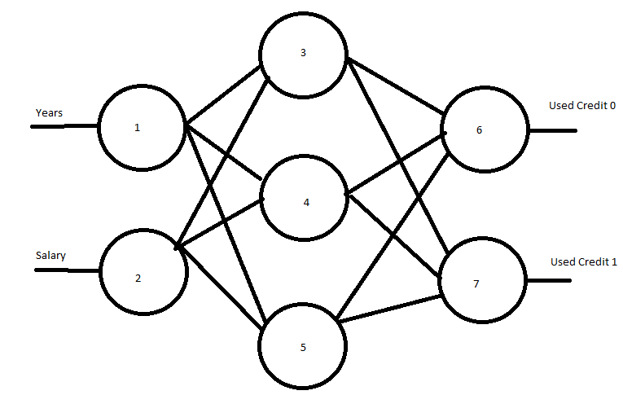

```{r setup, include=FALSE}
knitr::opts_chunk$set(echo = TRUE)
rm(list=ls())
```

```{r load libraries, message = FALSE}
library(neuralnet)
library(fastDummies)
library(caret)
library(dplyr)
library(e1071)
```

### 11.1 Credit Card Use



Using this crap drawing of what I will be doing, I will walkthrough the ANN calculation for 1 set of inputs with random low seeds.

```{r ann hand calc}
#later 0 (input layer)
year <- 4
salary <- 43

#initial weights and betas
w <- runif(12, -0.05,0.05)
b <- runif(5, -0.3,0.3)

#layer 1
#node 3 = (4 * w1) + (43 * w2) + beta1
#node 4 = (4 * w3) + (43 * w4) + beta2
#node 5 = (4 * w5) + (43 * w6) + beta3

n3 <- sigmoid((year * w[1]) + (salary * w[2]) + b[1])
n4 <- sigmoid((year * w[3]) + (salary * w[4]) + b[2])
n5 <- sigmoid((year * w[5]) + (salary * w[6]) + b[3])

#layer 2 (output layer)
#node 6 = (node3 * w7) + (node4 * w8) + (node5 * w9) + beta4
#node 7 = (node3 * w10) + (node4 * w11) + (node5 * w12) + beta5

usedCredit.0 <- sigmoid((n3 * w[7]) + (n4 * w[8]) + (n5 * w[9]) + b[4])
usedCredit.1 <- sigmoid((n3 * w[10]) + (n4 * w[11]) + (n5 * w[12]) + b[5])

#adjust the values to add to 1.0

usedCredit.0 <- usedCredit.0 / (usedCredit.0 + usedCredit.1)
usedCredit.1 <- 1 - usedCredit.0
```

The calculated values with random weights and biases are `r usedCredit.0` and `r usedCredit.1`. We can compare this to the known value of the input 0 and adjust the weights accordingly to increase the 0 rating and decrease the 1 rating


### 11.2 Neural Net Evolution

As stated, ANNs start with typically random starting seed which account for the variation in training result each time. What allows all ANNs to converge in accuracy regardless of seed is backpropogation. Back propogation is the process of adjusting the weights into a layer of nodes after the calculation is complete in order to increase the desired class and decrease the incorrect classes propensity scores for a given input. This weight adjustment can be taken at each layer all the way back to the original set of inputs and for all different inputs. Each round of backpropogation increases the performance of the model and reduces the model's error until the error cannot be improved and the model has efficiently "learned" the training data. When considering backpropogation for a set of input data the adjustments made are the average of all individual calculated adjustments, then another round of training can continue. This is called case updating (updating for 1 input) vs. batch updating (for a set of inputs)

Back propogation can stop after a certain minimum predetermined threshold of change in the weights is not met or a target classification error is reached, or after a predetermined number of rounds.

### 11.3 Toyota Corolla

In the below excercise I train a series of ANNs on a set of data relating to the sale of Toyota Corollas. I use the exact same parameters in each model and modify only the number of hidden layers and the dimensions of those layers.

First I load the dataset and normalize all columns before splitting the data into test and validation sets.

Next I train 4 ANNs, All discussion is beneath the last ANN validations.

The notation below indicates how many nodes there are from the input layer (17) to the output layer (1)
1) 17-2-1
2) 17-5-1
3) 17-5-5-1
4) 17-13-13-13-13-13-5-1

```{r load the data}
toyota <- read.csv("data/ToyotaCorolla.csv")

toyota <- fastDummies::dummy_cols(toyota, select_columns = "Fuel_Type")
toyota <- toyota %>% select(Price,Age_08_04,KM,Fuel_Type_Diesel,Fuel_Type_Petrol,Fuel_Type_CNG,HP,Automatic,Doors,Quarterly_Tax,Mfr_Guarantee,Guarantee_Period,Airco,Automatic_airco,CD_Player,Powered_Windows,Sport_Model,Tow_Bar)

maxs <- apply(toyota, 2, max) 
mins <- apply(toyota, 2, min)
toyota.range <- as.data.frame(scale(toyota, center = mins, scale = maxs - mins))

trainIndex <- createDataPartition(toyota$Price, p = 0.8, list = FALSE)
toyota.range.train <- toyota.range[trainIndex, ]
toyota.range.valid <- toyota.range[-trainIndex, ]
```

```{r train the ANN with 1 hidden layer 2 nodes}
trainstart <- Sys.time();
toyota.nn <- neuralnet(formula = Price ~ Age_08_04 + KM + Fuel_Type_Diesel + Fuel_Type_Petrol + Fuel_Type_CNG + HP + Automatic + Doors + Quarterly_Tax + Mfr_Guarantee + Guarantee_Period + Airco + Automatic_airco + CD_Player + Powered_Windows + Sport_Model + Tow_Bar, data = toyota.range.train, hidden = 2, linear.output = T)
Sys.time() - trainstart
```

```{r evaluate the ANN}
#drop the Price column because its the predicted value
toyota.training.pred <- neuralnet::compute(toyota.nn, toyota.range.train[,2:18])

toyota.training.predictions <- toyota.training.pred$net.result*(max(toyota$Price)-min(toyota$Price))+min(toyota$Price)
toyota.training.actuals <- toyota[trainIndex,1]

#training set RMSE
RMSE(toyota.training.predictions, toyota.training.actuals)

toyota.validation.pred <- neuralnet::compute(toyota.nn, toyota.range.valid[,2:18])

toyota.validation.predictions <- toyota.validation.pred$net.result*(max(toyota$Price)-min(toyota$Price))+min(toyota$Price)
toyota.validation.actuals <- toyota[-trainIndex,1]

#validation set RMSE
RMSE(toyota.validation.predictions, toyota.validation.actuals)

```

```{r train the ANN with 1 hidden layer 5 nodes}
trainstart <- Sys.time();
toyota.nn <- neuralnet(formula = Price ~ Age_08_04 + KM + Fuel_Type_Diesel + Fuel_Type_Petrol + Fuel_Type_CNG + HP + Automatic + Doors + Quarterly_Tax + Mfr_Guarantee + Guarantee_Period + Airco + Automatic_airco + CD_Player + Powered_Windows + Sport_Model + Tow_Bar, data = toyota.range.train, hidden = 5, linear.output = T)
Sys.time() - trainstart
```

```{r evaluate the 2nd ANN}
#drop the Price column because its the predicted value
toyota.training.pred <- neuralnet::compute(toyota.nn, toyota.range.train[,2:18])

toyota.training.predictions <- toyota.training.pred$net.result*(max(toyota$Price)-min(toyota$Price))+min(toyota$Price)
toyota.training.actuals <- toyota[trainIndex,1]

#training set RMSE
RMSE(toyota.training.predictions, toyota.training.actuals)

toyota.validation.pred <- neuralnet::compute(toyota.nn, toyota.range.valid[,2:18])

toyota.validation.predictions <- toyota.validation.pred$net.result*(max(toyota$Price)-min(toyota$Price))+min(toyota$Price)
toyota.validation.actuals <- toyota[-trainIndex,1]

#validation set RMSE
RMSE(toyota.validation.predictions, toyota.validation.actuals)
```


```{r train the ANN with 2 hidden layer 5 nodes each}
trainstart <- Sys.time();
toyota.nn <- neuralnet(formula = Price ~ Age_08_04 + KM + Fuel_Type_Diesel + Fuel_Type_Petrol + Fuel_Type_CNG + HP + Automatic + Doors + Quarterly_Tax + Mfr_Guarantee + Guarantee_Period + Airco + Automatic_airco + CD_Player + Powered_Windows + Sport_Model + Tow_Bar, data = toyota.range.train, hidden = c(5,5), linear.output = T)
Sys.time() - trainstart
```

```{r evaluate the 3rd ANN}
#drop the Price column because its the predicted value
toyota.training.pred <- neuralnet::compute(toyota.nn, toyota.range.train[,2:18])

toyota.training.predictions <- toyota.training.pred$net.result*(max(toyota$Price)-min(toyota$Price))+min(toyota$Price)
toyota.training.actuals <- toyota[trainIndex,1]

#training set RMSE
RMSE(toyota.training.predictions, toyota.training.actuals)

toyota.validation.pred <- neuralnet::compute(toyota.nn, toyota.range.valid[,2:18])

toyota.validation.predictions <- toyota.validation.pred$net.result*(max(toyota$Price)-min(toyota$Price))+min(toyota$Price)
toyota.validation.actuals <- toyota[-trainIndex,1]

#validation set RMSE
RMSE(toyota.validation.predictions, toyota.validation.actuals)
```

```{r train the ANN with 6 hidden layer 13 nodes each and 5 in the second to last}
trainstart <- Sys.time();
toyota.nn <- neuralnet(formula = Price ~ Age_08_04 + KM + Fuel_Type_Diesel + Fuel_Type_Petrol + Fuel_Type_CNG + HP + Automatic + Doors + Quarterly_Tax + Mfr_Guarantee + Guarantee_Period + Airco + Automatic_airco + CD_Player + Powered_Windows + Sport_Model + Tow_Bar, data = toyota.range.train, hidden = c(13,13,13,13,13,5), linear.output = T)
Sys.time() - trainstart
```

```{r evaluate the 4th ANN}
#drop the Price column because its the predicted value
toyota.training.pred <- neuralnet::compute(toyota.nn, toyota.range.train[,2:18])

toyota.training.predictions <- toyota.training.pred$net.result*(max(toyota$Price)-min(toyota$Price))+min(toyota$Price)
toyota.training.actuals <- toyota[trainIndex,1]

#training set RMSE
RMSE(toyota.training.predictions, toyota.training.actuals)

toyota.validation.pred <- neuralnet::compute(toyota.nn, toyota.range.valid[,2:18])

toyota.validation.predictions <- toyota.validation.pred$net.result*(max(toyota$Price)-min(toyota$Price))+min(toyota$Price)
toyota.validation.actuals <- toyota[-trainIndex,1]

#validation set RMSE
RMSE(toyota.validation.predictions, toyota.validation.actuals)
```

i. RMSE for the the training set decreases with each additional layer and more nodes in each layer. This is because there are more nodes/weights to capture the relationships between each variable and their impact on the final price of a Corolla.

ii. The RMSE for the validation data increases however, using only a single partition to train my model I am likely overfitting the test set and not finding any additional relationships/benefit by increasing the number of nodes/layers without any sort of additional partition or ensemble of ANNs.

iii. When deciding on a number of nodes/hidden layers its important to think about accuracy and train time. Because the number of new data points that I believe the car dealership will aquire (a low frequency of sales) a higher number of hidden layers and nodes could be justified. I would recommend a larger number of hidden layers (5-6) because we could use the entire dataset as the training set, and retrain the production model with each data point or even 1 time a night (or not if there is no new data) with relative ease.

### 11.4 East-West Airlines

For this exercise I train several ANNs predicting the likelihood of a positive response from a marketing campaign. All discussion is found at the bottom after the code.

```{r load the airline data}

airline = na.omit(read.csv("data/EastWestAirlinesNN.csv"))

maxs <- apply(airline, 2, max) 
mins <- apply(airline, 2, min)
airline.range <- as.data.frame(scale(airline, center = mins, scale = maxs - mins))

trainIndex <- createDataPartition(airline$Phone_sale, p = 0.8, list = FALSE)
airline.train <- airline.range[trainIndex, ]
airline.valid <- airline.range[-trainIndex, ]
```

```{r train the airline ANN with 1 hidden layer and 5 nodes}
trainstart <- Sys.time();
airline.nn <- neuralnet(formula = Phone_sale ~ Topflight + Balance + Qual_miles + cc1_miles. + cc2_miles. + cc3_miles. + Bonus_miles + Bonus_trans + Flight_miles_12mo + Flight_trans_12 + Online_12 + Email + Club_member + Any_cc_miles_12mo, data = airline.range, hidden = 5 , linear.output = F)
Sys.time() - trainstart
```

```{r evaluate airline nn}
airline.train.pred <- neuralnet::compute(airline.nn, airline.train[,2:15])
airline.train.actuals <- airline[trainIndex,16]

library(gains)

gain <- gains(airline.train.actuals, airline.train.pred$net.result)
barplot(gain$mean.resp/mean(airline.train.actuals), names.arg = gain$depth, xlab = "Percentile", ylab = "Mean Response", main = "Decile-wise lift chart of training data with 5 hidden nodes")

airline.valid.pred <- neuralnet::compute(airline.nn, airline.valid[,2:15])
airline.valid.actuals <- airline[-trainIndex,16]

gain <- gains(airline.valid.actuals, airline.valid.pred$net.result)
barplot(gain$mean.resp/mean(airline.valid.actuals), names.arg = gain$depth, xlab = "Percentile", ylab = "Mean Response", main = "Decile-wise lift chart of validation data with 5 hidden nodes")

plot(airline.nn, rep = "best")
```

```{r train the ANN with 1 hidden layer 1 node}
trainstart <- Sys.time();
airline.nn <- neuralnet(formula = Phone_sale ~ Topflight + Balance + Qual_miles + cc1_miles. + cc2_miles. + cc3_miles. + Bonus_miles + Bonus_trans + Flight_miles_12mo + Flight_trans_12 + Online_12 + Email + Club_member + Any_cc_miles_12mo, data = airline.range, hidden = 1 , linear.output = F)
Sys.time() - trainstart
```

```{r evaluate airline nn 2}
airline.train.pred <- neuralnet::compute(airline.nn, airline.train[,2:15])
airline.train.actuals <- airline[trainIndex,16]

#lift chart for training
gain <- gains(airline.train.actuals, airline.train.pred$net.result)
barplot(gain$mean.resp/mean(airline.train.actuals), names.arg = gain$depth, xlab = "Percentile", ylab = "Mean Response", main = "Decile-wise lift chart of training data with 1 hidden node")

airline.valid.pred <- neuralnet::compute(airline.nn, airline.valid[,2:15])
airline.valid.actuals <- airline[-trainIndex,16]

#lift chart for validation
gain <- gains(airline.valid.actuals, airline.valid.pred$net.result)
barplot(gain$mean.resp/mean(airline.valid.actuals), names.arg = gain$depth, xlab = "Percentile", ylab = "Mean Response", main = "Decile-wise lift chart of validation data with 1 hidden node")


plot(airline.nn, rep = "best")
```

a. The lift charts for the training and validation set using 5 hidden nodes show a good model because the highest lift is in the 10th percentile and decending on the way down. The meaning of the leftmost bar is that for the test set, the ANN's top 10% of propensity scores is likely to contain 2.5 times more positives than a random sample of the data. For validation set the value was actually higher at almost 3 times more likely.

b. The training and validation data differ slightly in that the training data has the first 6 deciles above 1.0 (meaning more likely than the random sample to be postive) whereas the validation set had higher scores in the left meaning it is more likely to assign the a high propensity score (meaning a predicted positive) in the earlier deciles. This can be valuable because the postives represented only 13% of the total data so a model that is good at identifying positives delivers value.

c. Our second ANN below uses only 1 hidden node. Our performance in the 1st decile is worse in both train and validation but there are far less deciles with a negative lift. This model can be seen as more stable in that it is likely to predict slightly better in most deciles in comparison to a random sample of the data, but hardly by much. The 5 hidden node model performed significantly better in its earliest deciles and thus a combination of the two models could be used. The average error of the two models combined can be no lower than the error of the worst individual model and the practice of ensembling models is used to reduce average error.

d. In the model of the single hidden node, the highest weight seems to be Balance, meaning that it individually has the greatest impact on the outcome. The more hidden nodes the more difficult it becomes to perceive any individual value in a variable. Which is seen clearly in the first chart.
