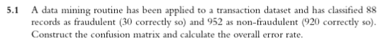

```{r setup, include=FALSE}
knitr::opts_chunk$set(echo = TRUE)
```

### 5.1



The confusion matrix would look as follows:

TP = 30
FP = 58
TN = 920
FN = 32
```
    1     0
       |
1  30  | 58
-------|-----
0  32  | 920
       |
```
The error rate is equal to the number of incorrect predictions divided by the number of predictions:  (58 + 32) / (952 + 88) \* 100 = `r (58 + 32) / (952 + 88) * 100`%


### 5.2


With an adjustable cutoff for classifying a fraud from a propensity:

a. An increase in the cutoff would lower the error rate of fraudulent classifications, but this comes at cost of assigning the class fraudulent less times. Only the highest propensity scores would be marked as fraudulent and we would expect less false positives. Lowering the cutoff would increase the error rate because more values would be classified as fraud that are not fraud because we know fraud is a rare event.

b. An increase in the cutoff would lower error rate for nonfraudulent transactions (to an extent) because we know that there are more false postives than true positives. This might indicate that out model could be tuned to classify more true negatives and without increasing the number of false negatives. A decrease in the cutoff would increase error rate of nonfraudulent classification because there are more fraudulents cases to missclassify than there are currently missclassified nonfraudulent cases. 

### 5.3


### 5.4


a. The first and second bars on the left represent the 10th and 20th percentile of the data set (sorted by most likely to be fraud being in the earliest percentiles). The postive values of the 1st and 2nd decile tell us that our model has a "lift" over a random sample of the data set, meaning that the values with the highest propensity scores as determined by our model are more likely to be fraud than a random sample. Since we know we have 1040 data points and 30 of them are fraud, 10% of our dataset should have 3 (on average) cases of fraud if selected randomly. A lift of 6 on this decile chart tells me that we actually found 6 times as many cases, or 18 in the models 10% most likely cases of fraud. The same math can be applied with the second decile where we would have likely have found 3 more cases of fraud but found 8 or 9. This tells us that our model is performing better than a random sampling of the data.

b. When deciding if a model is worth using or not, a decile chart visualizes a models performance versus a very naive assumption that the likelihood of any transaction being fraud is equal and equates it to essentially a coin flip (where the % chance of heads is the average rate it occurs in the set). Our chart shows that we can isolate propensity scores that likely indicate fraud better than a random guess could, by proving that the highest scores (the left of the chart) are more likely to be fraud than random samples. This would be a good model. A bad model would look flat and be centered around 1.0, meaning that the model is no more likely than a random sample of points to find fraud.

c. OK other analyist... Assuming the same results from above (1040 data points, 30 fraudulent, an error rate of 8.653846%) we would classify 1040 points as non fraudulent, have 30 incorrect classifications, and an error rate of 30 / 1040 \* 100 = `r 30 / 1040 * 100`%

This is definitely a better error rate, but this model is essentially useless to us because the cost of fraud != the cost of nonfraud. Fraud is incredibly expensive and we would prefer a model that had a higher error rate if it meant it could better classify fraud. If we compared sensitivities of the two models we would have 30 / (30 + 32) = `r 30 / (30 + 32)` vs. 0

d.

### 5.5


### 5.7

